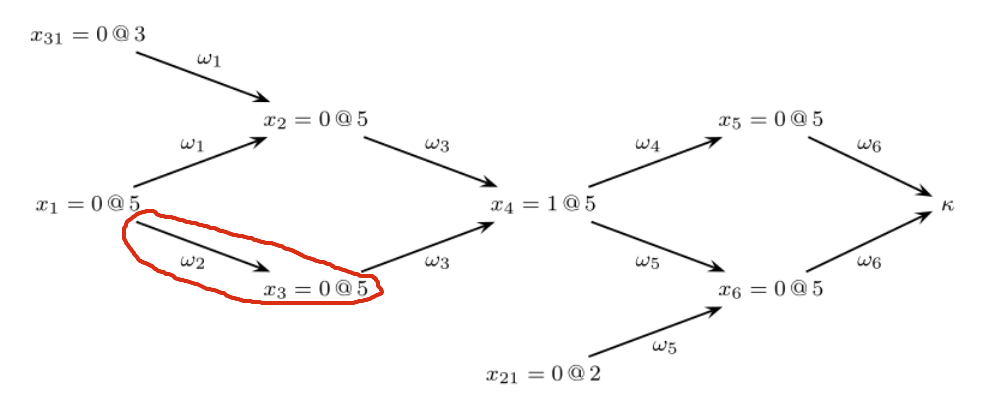
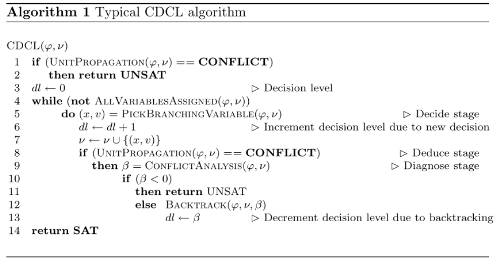

# The Implementation

In the code, I frequently use the [dataclass](https://docs.python.org/3/library/dataclasses.html) from standard library. Basically it is just a shorthand for defining a small class storing only few properties. It saves the code for us to define `__init__` function, and better default string representation:

```python
from dataclasses import dataclass

@dataclass
class Animal:
    name: str
    kind: str
    age: int

print(Animal('Pikachu', 'Cat', 3))  
# output: Animal(name='Pikachu', kind='Cat', age=3)
```

It becomes clear on what a class stores.


## Structures

Next, we implement the class for

- Literal = `var + negation?`
- Clause = `List[Literal]`
- Formula = `List[Clause]`

Instead of representing them with primitive types, put them into individual classes are easier to read in my opinion.

The variables are represented as integer. First import all the standard libraries we used:

```python
import sys
import random
from pprint import pprint
from dataclasses import dataclass
from typing import List, Set, Tuple, Optional, Iterator
```


### Literal

```python
# frozen to be hashable
@dataclass(frozen=True)
class Literal:
    variable: int
    negation: bool

    def __repr__(self):
        if self.negation:
            return '¬' + str(self.variable)
        else:
            return str(self.variable)

	def neg(self) -> 'Literal':
        """
        Return the negation of this literal.
        """
        return Literal(self.variable, not self.negation)
```


### Clause

The clause is just a list of literals.

```python
@dataclass
class Clause:
    literals: List[Literal]

    def __repr__(self):
        return '∨'.join(map(str, self.literals))

    def __iter__(self) -> Iterator[Literal]:
        return iter(self.literals)

    def __len__(self):
        return len(self.literals)
```


### Formula

The formula is just a list of clauses. We remove duplicate literals like \\((1∨ 1 ∨ 2)\\) and cache the variables in the constructor.

```python
@dataclass
class Formula:
    clauses: List[Clause]
    __variables: Set[int]

    def __init__(self, clauses: List[Clause]):
        """
        Remove duplicate literals in clauses.
        """
        self.clauses = []
        self.__variables = set()
        for clause in clauses:
            self.clauses.append(Clause(list(set(clause))))
            for lit in clause:
                var = lit.variable
                self.__variables.add(var)

    def variables(self) -> Set[int]:
        """
        Return the set of variables contained in this formula.
        """
        return self.__variables

    def __repr__(self):
        return ' ∧ '.join(f'({clause})' for clause in self.clauses)

    def __iter__(self) -> Iterator[Clause]:
        return iter(self.clauses)

    def __len__(self):
        return len(self.clauses)
```


### Assignment

`Assignment` class represent one assignment to a variable. It contains

- The value (`True` or `False`) of what the variable assigned to.
- The optional antecedent of this assignment. The antecedent is the clause that forced this assignment due to unit constraint. If this assignment is due to decision (guessing), then antecedent is `None`.
- `dl` - The decision level of this assignment.


```python
@dataclass
class Assignment:
    value: bool
    antecedent: Optional[Clause]
    dl: int  # decision level
```



An instance of `Assignment` contains the information in the red circle.

- `value` = 0 (False)
- `antecedent` = \\(\omega_2\\)
- `dl` = 5


### Assignments

`Assignments` is the partial assignments of variables, maps an `int` to `Assignment`. An efficient representation of assignments should be stored in a list trail, which improve the backtrack efficiency.

I also added a utility method `value` here.

```python
class Assignments(dict):
    """
    The assignments, also stores the current decision level.
    """
    def __init__(self):
        super().__init__()

        # the decision level
        self.dl = 0

    def value(self, literal: Literal) -> bool:
        """
        Return the value of the literal with respect the current assignments.
        """
        if literal.negation:
            return not self[literal.variable].value
        else:
            return self[literal.variable].value

    def assign(self, variable: int, value: bool, antecedent: Optional[Clause]):
        self[variable] = Assignment(value, antecedent, self.dl)

    def unassign(self, variable: int):
        self.pop(variable)

    def satisfy(self, formula: Formula) -> bool:
        """
        Check whether the assignments actually satisfies the formula. 
        """
        for clause in formula:
            if True not in [self.value(lit) for lit in clause]:
                return False

        return True
```


## Main Procedures

Having defined all the needed classes, now are the hard parts. We will implement the full CDCL solver here.

The CDCL algorithm generally follows the structure:

Note that \\(\nu\\) above is the partial assignments, which represented by `assignments` in our code.

Translate it into Python code:

### `cdcl_solve`

We return the `learnt_clause` from `conflict_analysis`, and add the `learnt_clause` to the formula afterward, and return the reason as well as the clause that are the cause of the reason from `unit_propagation`.

```python
def cdcl_solve(formula: Formula) -> Optional[Assignments]:
    """
    Solve the CNF formula.

    If SAT, return the assignments.
    If UNSAT, return None.
    """
    assignments = Assignments()
    
    # First, do unit propagation to assign the initial unit clauses 
    reason, clause = unit_propagation(formula, assignments)
    if reason == 'conflict':
        return None

    while not all_variables_assigned(formula, assignments):
        var, val = pick_branching_variable(formula, assignments)
        assignments.dl += 1
        assignments.assign(var, val, antecedent=None)
        while True:
            reason, clause = unit_propagation(formula, assignments)
            if reason != 'conflict':
                # no conflict after unit propagation, we back
                # to the decision (guessing) step
                break
                
            b, learnt_clause = conflict_analysis(clause, assignments)
            if b < 0:
                return None
            
            add_learnt_clause(formula, learnt_clause)
            backtrack(assignments, b)
            assignments.dl = b

            # The learnt clause must be a unit clause, so the
            # next step must again be unit progagation

    return assignments
```

Next, we implement all the functions mentioned in `cdcl_solve`. Starts from the easy to hard.


### `add_learnt_clause`

"Learning" a clause is just as simple as adding it to the formula.

```python
def add_learnt_clause(formula: Formula, clause: Clause):
    formula.clauses.append(clause)
```


### `all_variables_assigned`

As simple as it is:

```python
def all_variables_assigned(formula: Formula, assignments: Assignments) -> bool:
    return len(formula.variables()) == len(assignments)
```


### `pick_branching_variable`

Choose the next decision variable and its value based on our branching heuristic - no heuristic.

We randomly choose a variable in unassigned variables and randomly choose a value.

```python
def pick_branching_variable(formula: Formula, assignments: Assignments) -> Tuple[int, bool]:
    unassigned_vars = [var for var in formula.variables() if var not in assignments]
    var = random.choice(unassigned_vars)
    val = random.choice([True, False])
    return (var, val)
```


### `backtrack`

This function backtracks to decision level \\(b\\), removing all the assignment of variables with decision level \\(\gt b\\).

```python
def backtrack(assignments: Assignments, b: int):
    to_remove = []
    for var, assignment in assignments.items():
        if assignment.dl > b:
            to_remove.append(var)
            
	for var in to_remove:
        assignments.pop(var)
```


### `unit_propagation`

Next is unit propagation. We detect conflict or unit clause in this function, and return the reason and the corresponding clause.

```python
def clause_status(clause: Clause, assignments: Assignments) -> str:
    """
    Return the status of the clause with respect to the assignments.

    There are 4 possible status of a clause:
      1. Unit - All but one literal are assigned False
      2. Unsatisfied - All literals are assigned False
      3. Satisfied - All literals are assigned True
      4. Unresolved - Neither unit, satisfied nor unsatisfied
    """
    values = []
    for literal in clause:
        if literal.variable not in assignments:
            values.append(None)
        else:
            values.append(assignments.value(literal))

    if True in values:
        return 'satisfied'
    elif values.count(False) == len(values):
        return 'unsatisfied'
    elif values.count(False) == len(values) - 1:
        return 'unit'
    else:
        return 'unresolved'


def unit_propagation(formula: Formula, assignments: Assignments) -> Tuple[str, Optional[Clause]]:
    # finish is set to True if no unit and conflict clause found in one iteration
    finish = False
    while not finish:
        finish = True
        for clause in formula:
            status = clause_status(clause, assignments)
            if status == 'unresolved' or status == 'satisfied':
                continue
            elif status == 'unit':
                # select the literal to propagate
                literal = next(literal for literal in clause if literal.variable not in assignments)
                var = literal.variable
                val = not literal.negation

                # assign the variable according to unit rule
                assignments.assign(var, val, antecedent=clause)
                finish = False
            else:
                # conflict
                return ('conflict', clause)

    return ('unresolved', None)
```


### `conflict_analysis`

`conflict_analysis` finds the the backtrack level and the newly learnt clause, which comes from the first UIP cut.

It follows the formula (see the section above: [Exploiting Structure with UIPs](The-Theory.md#exploiting-structure-with-uips)):
\\[
w_L^{d,i} = \begin{cases}
\alpha(\kappa),&i=0 \\\\
w_L^{d,i-1} \odot \alpha(l).&i\ne 0 ∧ \xi(w_L^{d,i-1},l,d) = 1 \\\\
w_L^{d,i-1},& i\ne 0 ∧ \sigma(w_L^{d,i-1},d) = 1
\end{cases}
\\]
We first define the resolution operation, then the main `conflict_analysis` function:

```python
def resolve(a: Clause, b: Clause, x: int) -> Clause:
    """
    The resolution operation
    """
    result = set(a.literals + b.literals) - {Literal(x, True), Literal(x, False)}
    result = list(result)
    return Clause(result)


def conflict_analysis(clause: Clause, assignments: Assignments) -> Tuple[int, Clause]:
    if assignments.dl == 0:
        return (-1, None)
 
    # literals with current decision level
    literals = [literal for literal in clause if assignments[literal.variable].dl == assignments.dl]
    while len(literals) != 1:
        # implied literals
        literals = filter(lambda lit: assignments[lit.variable].antecedent != None, literals)

        # select any literal that meets the criterion
        literal = next(literals)
        antecedent = assignments[literal.variable].antecedent
        clause = resolve(clause, antecedent, literal.variable)

        # literals with current decision level
        literals = [literal for literal in clause if assignments[literal.variable].dl == assignments.dl]

    # out of the loop, `clause` is now the new learnt clause
    # compute the backtrack level b (second largest decision level)
    decision_levels = sorted(set(assignments[literal.variable].dl for literal in clause))
    if len(decision_levels) <= 1:
        return 0, clause
    else:
        return decision_levels[-2], clause
```


### DIMACS CNF

The [DIMACS CNF](https://people.sc.fsu.edu/~jburkardt/data/cnf/cnf.html) format is a textual representation of a formula in conjunctive normal form.

For example, the formula \\((1∨2∨¬ 3) ∧ (¬ 2 ∧ 3)\\) can be encoded as:

```
p cnf 3 2
1 2 -3 0
-2 3 0
```


#### `parse_dimacs_cnf`

Here is the code to parse DIMACS CNF file to a `Formula`, you can take it as given:

```python
def parse_dimacs_cnf(content: str) -> Formula:
    """
    parse the DIMACS cnf file format into corresponding Formula.
    """
    clauses = [Clause([])]
    for line in content.splitlines():
        tokens = line.split()
        if len(tokens) != 0 and tokens[0] not in ("p", "c"):
            for tok in tokens:
                lit = int(tok)
                if lit == 0:
                    clauses.append(Clause([]))
                else:
                    var = abs(lit)
                    neg = lit < 0
                    clauses[-1].literals.append(Literal(var, neg))

    if len(clauses[-1]) == 0:
        clauses.pop()

    return Formula(clauses)
```

and we have just successfully implemented a CDCL solver in less than 300 lines of code, try it out:

```python
if __name__ == '__main__':
    # you might comment it to get inconsistent execution time
    random.seed(5201314)

    if len(sys.argv) != 2:
        print('Provide one DIMACS cnf filename as argument.')
        sys.exit(1)
        
    dimacs_cnf = open(sys.argv[1]).read()
    formula = parse_dimacs_cnf(dimacs_cnf)
    result = cdcl_solve(formula)
    if result:
        assert result.satisfy(formula)
        print('Formula is SAT with assignments:')
        assignments = {var: assignment.value for var, assignment in result.items()}
        pprint(assignments)
    else:
        print('Formula is UNSAT.')
```
