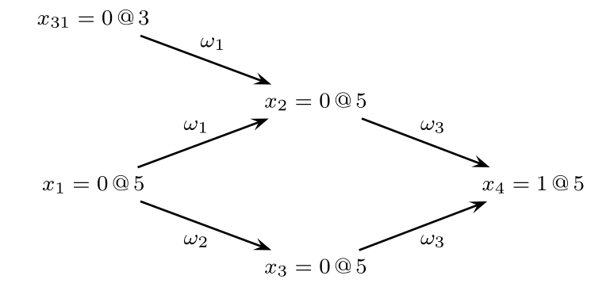
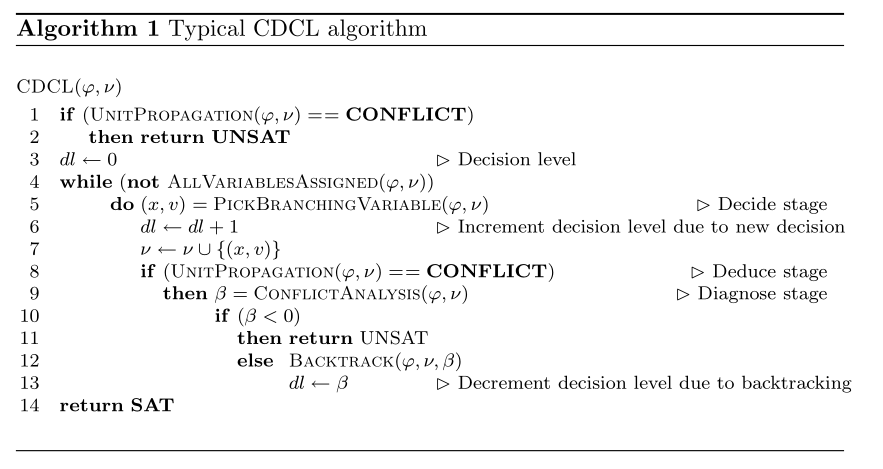
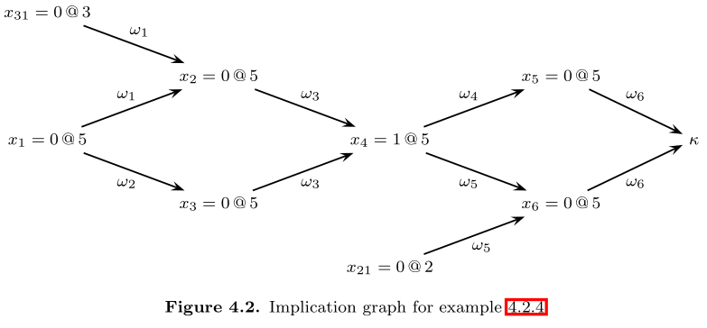
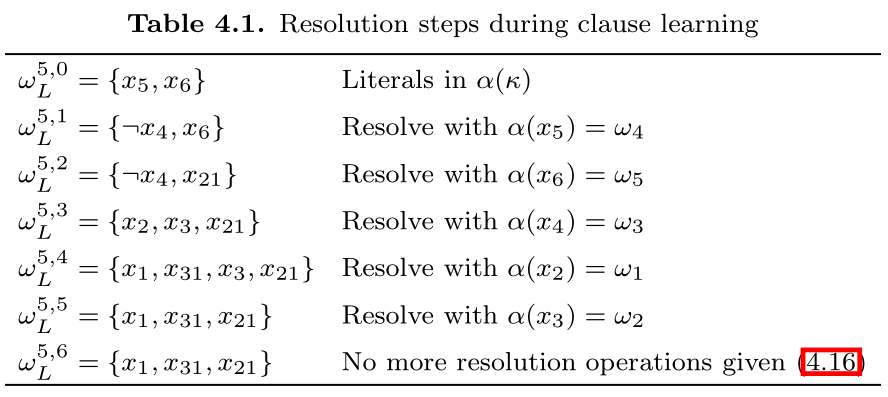
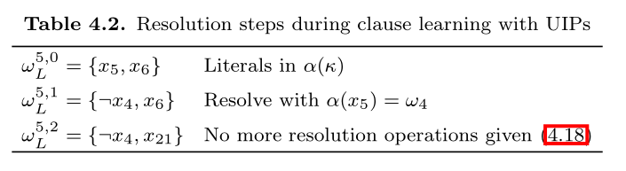

# The Theory

- Everything in this section is taken from [Handbook of Satisfiability Chapter 4: Conflict-Driven Clause Learning SAT Solvers](https://www.cs.princeton.edu/~zkincaid/courses/fall18/readings/SATHandbook-CDCL.pdf).

CDCL SAT solvers primarily inspired by DPLL solvers. DPLL corresponds to **backtrack search**, where each step a variable and a propositional value are selected for branching purposes. With each branching step, two values can be assigned to a variable: 0 or 1. Branching corresponds to assign the chosen value to the chosen variable. Afterwards, the logical consequences of each branching step are evaluated. Each time an unsatisfied clause (conflict) is identified, **backtracking** is executed.

If for the first branching step, both values have been considered, and backtracking undoes this first branching step, then the CNF formula can be declared **unsatisfiable**. This kind of backtrack is called **chronological backtracking**. Alternative backtracking scheme is **non-chronological backtracking**, which described later.

A state-of-art CDCL SAT solver involves a number of key techniques:

- Learning new clause from conflicts during backtrack search.
- Exploiting structure of conflicts during clause learning.
- Branching and restart heuristics.

I won't cover branching and restart heuristic here. They can be added to the code space relatively easily.

## 1. Notation

Propositional formulas are represented in Conjunctive Normal form (CNF).

- A finite set of Boolean variables \\(X=\\{x_1,x_2,\cdots,x_n\\}\\) is assumed.
- We use \\(w\\) to denote a clause.
- We use \\(\phi\\) to denote a CNF formula, consists of a conjunction of clauses.
- A literal \\(l\\) is either a variable \\(x\\) or its complement \\(¬ x\\).

#### Assignments

Assignments to the problem variables can be defined as a function \\(\nu:X\to\\{0,u,1\\}\\) where \\(u\\) denotes an **undefined** value.

- If all variables are assigned a value \\(\\{0,1\\}\\), then \\(\nu\\) is referred to as a **complete assignment**, otherwise it is a partial assignment.
- \\(l^\nu\\) denotes the value of a literal \\(l\\) under assignment \\(\nu\\).
- \\(w^\nu\\) denotes the value of a clause \\(w\\) under assignment \\(\nu\\).
- \\(\phi^\nu\\) denotes the value of the formula \\(\phi\\) under assignment \\(\nu\\).

\\[
\begin{align}
l^\nu &= \begin{cases}
\nu(x_i),&l=x_i \\\\
1-\nu(x_i),&l=¬ x_i
\end{cases} \\\\
w^\nu &= \max\\{l^\nu | l\in w\\} \\\\
\phi^\nu &= \min\\{w^\nu | w\in\phi\\}
\end{align}
\\]

#### Clauses

Clauses are characterized as **unsatisfied**, **satisfied**, **unit**, or **unresolved**.

- A clause is **unsatisfied** if all its literals are assigned to value 0 under the assignment.
- A clause is **unit** if all literals but one are assigned value 0, and the one literal are unassigned.
- A clause is **satisfied** if at least one of its literal is assigned to value 1.
- A clause is **unresolved** if neither falls in satisfied, unsatisfied or unit.

A key procedure in SAT solvers is the **unit clause rule**: if a clause is unit, then its sole unassigned literal must be assigned to value 1. The iterated application of unit clause rule is referred to as **unit propagation** or **Boolean constraint propagation (BCP)**.

Unit propagation is applied after each branching step, and is used for identifying variables which must be assigned a specific Boolean value. If an unsatisfied clause is identified, a **conflict** condition is declared, and the algorithm backtracks.

#### Value, Antecedent and Decision Level

Each variable \\(x_i\\) is characterized by a number of properties, including the **value**, **antecedent** and the **decision level** of it.

The **value** of \\(x_i\\) is the assigned value of it given the assignment

\\[
\nu(x_i) \in \\{0,u,1\\}
\\]

where 0 = False, 1 = True, \\(u\\) = Unassigned.

The **antecedent** of \\(x_i\\) is the unit clause \\(w\\) that implies it. For unassigned variables, or variables that are assigned by decision, then their antecedent is \\(\tt NIL\\).

$$
\alpha(x_i) \in \phi \cup\\{\tt{NIL}\\}
$$

The decision level for a variable \\(x_i\\) denotes the depth of the decision tree at which the variable is assigned a value in \\(\\{0,1\\}\\). The decision level for an unassigned value \\(x_i\\) is \\(-1\\).

$$
\delta(x_i) = \max(\\{0\\}\cup \\{\delta(x_j) \mid x_j \in w ∧ x_j \ne i\\})
$$

The formula above says that the decision level of an implied literal is either the highest decision level of the implied literals in a unit clause, or \\(0\\) if the clause is unit.

We use \\(x_i = v@d\\) to denote that \\(\nu(x_i) = v\\) and \\(\delta(x_i = d)\\).

#### Implication Graph

During the execution of DPLL-style SAT solver, assigned variables as well as their antecedents define a directed acyclic graph \\(I=(V_I,E_I)\\) referred to as **implication graph**.

The vertices in the implication graph are defined by all assigned variables and possibly one special node \\(\kappa\\) - the conflict node. The edges in the implication graph are obtained from the antecedent of each assigned variable. If \\(w=\alpha(x_i)\\), then there is a directed edge from each variable in \\(w\\) (other than \\(x_i\\) to \\(x_i\\).

If unit propagation yields an unsatisfied clause \\(w_j\\), then a special vertex \\(\kappa\\) is used to represent the unsatisfied clause. The antecedent of \\(\kappa\\) is defined by \\(\alpha(\kappa) = w_j\\).

**Example**:

Consider the CNF:

\\[
\begin{align}
\phi_i &= w_1∧ w_2 ∧ w_3 \\\\
&= (x_1 ∨ x_{31} ∨ ¬ x_2) ∧ (x_1 ∨ ¬ x_3) ∧ (x_2 ∨ x_3 ∨ x_4)
\end{align}
\\]

and assume the decision assignment \\(x\_{31}=0@3\\) and \\(x_1 = 0@5\\), then their implication graph is:

## 2. Organization of CDCL Solvers

The figure shows the typical algorithm for CDCL:

The main differences to DPLL solver is the call to function \\(\tt ConflictAnalysis\\) each time a conflict is identified, and a call to \\(\tt BackTrack\\) when backtracking takes place.

- \\(\tt UnitPropagation\\) consists of the iterated application of the unit clause rule. If an unsatisfied clause is identified, then a conflict indication is returned.
- \\(\tt PickBranchingValue\\) selects a variable to assign a value.
- \\(\tt ConflictAnalysis\\) analyzes the most recent conflict and learn a new clause from the conflict.
- \\(\tt AllVariablesAssigned\\) tests whether all variables have been assigned.

Some techniques like **search restarts** and **clause deletion** are not included in the algorithm above.

- **Search restarts** cause the algorithm to restart itself, but already learnt clauses are kept.
- **Clause deletion** policies decide which learnt clauses can be deleted to saves memory.

## 3. Conflict Analysis

### Learning Clauses from Conflicts

Each time the CDCL SAT solver identifies a conflict due to unit propagation, the \\(\tt ConflictAnalysis\\) procedure is invoked. One or more new clauses are learnt, and a backtracking decision level is computed.

Starting from a given conflict clause \\(\alpha(\kappa)\\), the conflict analysis procedure visits variables implied at the most recent decision level, identifies the antecedents of visited variables, and keeps from the antecedents of literals assigned at decision level **less than the most recent decision level**. This process is repeated until the most recent decision variable is visited.

Let \\(\odot\\) be the resolution operation. The resolution operation on two clause \\(w_i\\) and \\(w_j\\), for which there is a variable that \\(x\\) in one clause and \\(¬ x\\) in another clause, then the result of the resolution operation is all literals in \\(w_i\\) and \\(w_j\\) with the exception of \\(x\\) and \\(¬ x\\):

$$
w_i \odot w_j = w_i \cup w_j - \\{x,¬ x\\}
$$

Now we show how the new clause is learnt. The clause learning process in SAT solvers can be defined by a sequence of selective resolution operations. At each step, it yields a new temporary clause, and the final clause is the newly learnt clause.

First, we define a predicate \\(\xi(w,l,d)\\) which means if a clause \\(w\\) has an implied literal \\(l\\) assigned at the current decision level \\(d\\).

\\[
\xi(w,l,d) = \begin{cases}
1,&l\in w ∧ \delta (l) =d ∧ \alpha(l) \ne \tt NIL \\\\
0,&\text {otherwise}
\end{cases}
\\]

Let \\(w_L^{d,i}\\) with \\(i=0,1,\cdots\\) be the **intermediate clause** obtained after \\(i\\) resolution operations.

\\[
w_L^{d,i} = \begin{cases}
\alpha(\kappa),&i=0 \\\\
w_L^{d,i-1} \odot \alpha(l).&i\ne 0 ∧ \xi(w_L^{d,i-1},l,d) = 1 \\\\
w_L^{d,i-1},& i\ne 0 ∧ \forall _l \xi(w_L^{d,i-1},l,d)=0
\end{cases}
\\]

The explanation of \\(w_L^{d,i}\\):

- The initial intermediate clause is the antecedent of \\(\kappa\\), \\(\alpha(\kappa)\\).
- Afterwards, at each step \\(i\\), a literal \\(l\\) assigned at the current decision level \\(d\\) is selected from the current intermediate clause, the next intermediate clause \\(w\_{L}^{d,i}\\) is the result of resolution between the current intermediate clause:

$$
w_L^{d,i} = w_L^{d,i-1} \odot \alpha(l)
$$

- This continues until there left no literal in current intermediate clause with current decision level \\(d\\), or

$$
w_L^{d,i} = w_L^{d,i-1}
$$

The last intermediate clause is the new learnt clause. The number of resolutions performed will not greater than number of variables \\(|X|\\).

**Example**: Given the formula, with the implication graph

\\[
\begin{align}
\phi &= w_1 ∧ w_2 ∧ w_3 ∧ w_4 ∧ w_5 ∧ w_6 \\\\
&= (x_1 ∨ x_{31} ∨ ¬ x_2) ∧ (x_1 ∨ ¬ x_3) ∧ (x_2 ∨ x_3 ∨ x_3) \\\\
&~~~~~(¬ x_4 ∧ ¬ x_5) ∧ (x_{21} ∨ ¬ x_4 ∨ ¬ x_6) ∧ (x_5 ∨ x_6)
\end{align}
\\]

The table shows the resolution steps during clause learning.

There are many possible clauses to learn on one conflict. The learnt clause of method above is just the negation of literals of most recent decision level. However, we usually learn a new exploit the first UIP cut, explained in the next section:

### Exploiting Structure with UIPs {#expoiting-structure-with-uips}

A vertex \\(u\\) dominates another vertex \\(x\\) in a directed graph if every path from \\(x\\) to another vertex \\(\kappa\\) contains \\(u\\). A UIP (unique implication point) is a **dominator** in the implication graph, which dominates the decision vertex \\(x\\) with respect to the conflict vertex \\(\kappa\\).

In the implication graph, there is an UIP at decision level \\(d\\) when the number of literals in \\(w_L^{d,i}\\) assigned at decision level is 1. Let \\(\sigma(w,d)\\) be the number of literals in \\(w\\) assigned at decision level \\(d\\):

$$
\sigma(w,d) = |\\{l \in w \mid \delta(l) = d\\}|
$$

The clause learning procedure with UIPs is given by

\\[
w_L^{d,i} = \begin{cases}
\alpha(\kappa),&i=0 \\\\
w_L^{d,i-1} \odot \alpha(l).&i\ne 0 ∧ \xi(w_L^{d,i-1},l,d) = 1 \\\\
w_L^{d,i-1},& i\ne 0 ∧ \sigma(w_L^{d,i-1},d) = 1
\end{cases}
\\]

CDCL SAT solvers stop clause learning at the first UIP.

**Example**: Again with the previous example

\\[
\begin{align}
\phi &= w_1 ∧ w_2 ∧ w_3 ∧ w_4 ∧ w_5 ∧ w_6 \\\\
&= (x_1 ∨ x_{31} ∨ ¬ x_2) ∧ (x_1 ∨ ¬ x_3) ∧ (x_2 ∨ x_3 ∨ x_3) \\\\
&~~~~~(¬ x_4 ∧ ¬ x_5) ∧ (x_{21} ∨ ¬ x_4 ∨ ¬ x_6) ∧ (x_5 ∨ x_6)
\end{align}
\\]

The learning procedure stops at \\((¬ x_4 ∨ x_{21})\\) by taking into consideration that \\(x_4=1@5\\) is a UIP - the first UIP.

Finally, we start the code in next section.
