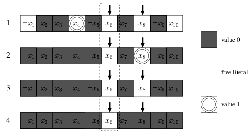

# Advanced: Two Watched Literals

In my experience, implementing the original CDCL algorithm is not the hard part. Most of the complexity and debug time lies on the lazy data structures - two watched literals.

You must read the two-watched literals section in the slide [From DPLL to CDCL SAT solvers](https://www.cs.upc.edu/~oliveras/LAI/cdcl.pdf) to understand the steps of two watched literals.

The main idea of two watched literals is: **A clause with 2 non-false literals cannot be unit or conflicting**.

In the following sections, we will modify our code to incorporate the two watched literals data structure in our CDCL solver.

## Implementation

First, we initialize the core data structure `lit2clauses` and `clause2lits`, where

- `lit2clauses[lit]` are the clauses that are watching literal `lit` now.
- `clause2lits[c]` are the literals that clause `c` are watching now. If `c` is unit clause, `len(clause2lits[c]) == 1` or else `len(clause2lits[c]) == 2`.

```python
from collections import defaultdict
def init_watches(formula: Formula):
    """
    Return lit2clauses and clause2lits
    """
    
    lit2clauses = defaultdict(list)
    clause2lits = defaultdict(list)
    
    for clause in formula:
        if len(clause) == 1:
            # For unit clause, we watch the only literal
            lit2clauses[clause.literals[0]].append(clause)
            clause2lits[clause].append(clause.literals[0])
        else:
            # For other clause, we choose any 2 literals to watch
            lit2clauses[clause.literals[0]].append(clause)
            lit2clauses[clause.literals[1]].append(clause)
            clause2lits[clause].append(clause.literals[0])
            clause2lits[clause].append(clause.literals[1])
            
    return lit2clauses, clause2lits
```

We also add `__hash__ ` function to the `Clause` class for it to be hashable. It is safe because `literals` shall not change after the formation of the clause.

```python
@dataclass
class Clause:
    literals: List[Literal]

    def __repr__(self):
        return '∨'.join(map(str, self.literals))

    def __iter__(self) -> Iterator[Literal]:
        return iter(self.literals)

    def __len__(self):
        return len(self.literals)

    def __hash__(self):
        x = 0 
        for lit in self.literals:
            x ^= hash(lit)
        return x
```

In the original CDCL algorithm, `unit_propagation` took most of the time, so the works of two watched literals lie most in `unit_propagation`.

You can run `python -m cProfile -s time cdcl.py cnf_file` to verify:

```
         7405674 function calls (7404843 primitive calls) in 2.189 seconds

   Ordered by: internal time

   ncalls  tottime  percall  cumtime  percall filename:lineno(function)
   832445    1.217    0.000    1.903    0.000 full-cdcl.py:182(clause_status)
  1631505    0.262    0.000    0.262    0.000 full-cdcl.py:90(value)
      270    0.191    0.001    2.100    0.008 full-cdcl.py:209(unit_propagation)
  2417388    0.158    0.000    0.158    0.000 {method 'append' of 'list' objects}
   841475    0.150    0.000    0.212    0.000 full-cdcl.py:34(__iter__)
   842221    0.062    0.000    0.062    0.000 {built-in method builtins.iter}
   301638    0.036    0.000    0.036    0.000 {method 'count' of 'list' objects}
306672/306669    0.022    0.000    0.022    0.000 {built-in method builtins.len}
...
```

For each clause, we will try to watch two non-false literals. With the exception of unit clause, we watch the only non-false literals.

If a literal becomes `False`, we visit the clause that contains it. Note that if a literal becomes `True`, then its negation becomes `False`.

- First, we initialize the watches `clause2lits` and `lit2clauses` from the formula. 

- For each assignment, we put the assigned literal into a stack pending to propagate.

- In `unit_propagate`, we pop off the literal `watching_lit` to propagate, try to rewatch `clause2lits[watching_lit]`, until conflict or the stack becomes empty.
  
  In the figure below, if \\(x_6\\) is to be assign `False`, only 4 possible cases might arise.
  
  
  
  - If we can find another non-false literal to rewatch, then rewatch it and all is fine. *(case 1)*
  - If we cannot find another non-false literal to watch, and another watching literal is assigned `True`, then do nothing. *(case 2)*
  - If we cannot find another non-false literal to watch, and another watching literal is unassigned, then the clause is unit, we assign it by unit rule and push it to the stack. *(case 3)*
  - If we cannot find another non-false literal to watch, and another watching literal is assigned `False`, then a conflict occurs, do the backtrack. *(case 4)*

```python
def unit_propagation(assignments, lit2clauses, clause2lits, to_propagate: List[Literal]) -> Tuple[str, Optional[Clause]]:
    while len(to_propagate) > 0:
        watching_lit = to_propagate.pop().neg()

        # use list(.) to copy it because size of 
        # lit2clauses[watching_lit]might change during for-loop
        watching_clauses = list(lit2clauses[watching_lit])
        for watching_clause in watching_clauses:
            for lit in watching_clause:
                if lit in clause2lits[watching_clause]:
                    # lit is another watching literal of watching_clause
                    continue
                elif lit.variable in assignments and assignments.value(lit) == False:
                    # lit is a assigned False
                    continue
                else:
                    # lit is not another watching literal of watching_clause
                    # and is non-False literal, so we rewatch it. (case 1)
                    clause2lits[watching_clause].remove(watching_lit)
                    clause2lits[watching_clause].append(lit)
                    lit2clauses[watching_lit].remove(watching_clause)
                    lit2clauses[lit].append(watching_clause)
                    break
            else:
                # we cannot find another literal to rewatch (case 2,3,4)
                watching_lits = clause2lits[watching_clause]
                if len(watching_lits) == 1:
                    # watching_clause is unit clause, and the only literal
                    # is assigned False, thus indicates a conflict
                    return ('conflict', watching_clause)
               	
                # the other watching literal
                other = watching_lits[0] if watching_lits[1] == watching_lit else watching_lits[1]
                if other.variable not in assignments:
                    # the other watching literal is unassigned. (case 3)
                    assignments.assign(other.variable, not other.negation, watching_clause)
                    to_propagate.insert(0, other)
                elif assignments.value(other) == True:
                    # the other watching literal is assigned True. (case 2)
                    continue
                else:
                    # the other watching literal is assigned False. (case 4)
                    return ('conflict', watching_clause)

    return ('unresolved', None)
```

In the `add_learnt_clause`, we need to add the watches of the newly learnt clause, the literals to watch must be the most recent assigned literals (with largest decision level).

```python
def add_learnt_clause(formula, clause, assignments, lit2clauses, clause2lits):
    formula.clauses.append(clause)
    for lit in sorted(clause, key=lambda lit: -assignments[lit.variable].dl):
        if len(clause2lits[clause]) < 2:
            clause2lits[clause].append(lit)
            lit2clauses[lit].append(clause)
        else:
            break
```

Finally, the `cdcl_solve` function. We first initialize the watches and prepare the stack of literals to be propagated.

```python
def cdcl_solve(formula: Formula) -> Optional[Assignments]:
    """
    Solve the CNF formula.

    If SAT, return the assignments.
    If UNSAT, return None.
    """
    assignments = Assignments()
    lit2clauses, clause2lits = init_watches(formula)
    
    # First, do unit propagation to assign the initial unit clauses 
    unit_clauses = [clause for clause in formula if len(clause) == 1]
    to_propagate = []
    for clause in unit_clauses:
        lit = clause.literals[0]
        var = lit.variable
        val = not lit.negation
        if var not in assignments:
            assignments.assign(var, val, clause)
            to_propagate.append(lit)
    
    reason, clause = unit_propagation(assignments, lit2clauses, clause2lits, to_propagate)
    if reason == 'conflict':
        return None

    while not all_variables_assigned(formula, assignments):
        var, val = pick_branching_variable(formula, assignments)
        assignments.dl += 1
        assignments.assign(var, val, antecedent=None)
        to_propagate = [Literal(var, not val)]
        while True:
            reason, clause = unit_propagation(assignments, lit2clauses, clause2lits, to_propagate)
            if reason != 'conflict':
                # no conflict after unit propagation, we back
                # to the decision (guessing) step
                break
                
            b, learnt_clause = conflict_analysis(clause, assignments)
            if b < 0:
                return None
            
            add_learnt_clause(formula, learnt_clause, assignments, lit2clauses, clause2lits)
            backtrack(assignments, b)
            assignments.dl = b

            # The learnt clause must be a unit clause, so the
            # next step must again be unit progagation
            literal = next(literal for literal in learnt_clause if literal.variable not in assignments)
            var = literal.variable
            val = not literal.negation
            assignments.assign(var, val, antecedent=learnt_clause)
            to_propagate = [Literal(var, not val)]

    return assignments
```

All is done!
